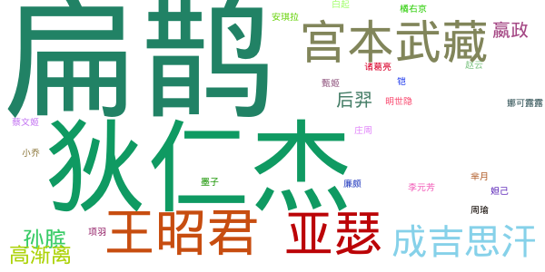

# golang生成词云

词云生成器，推荐[word_cloud](https://github.com/amueller/word_cloud)

尝试用golang生成词云，基本功能已实现

## Features 

- 单文件
- 控制基本参数：图片尺寸，背景颜色，字体大小、颜色
- WebUI，http接口两种方式

## todo

- Web端图片保存
- 文件处理：分词，计数，计算字体大小、颜色

